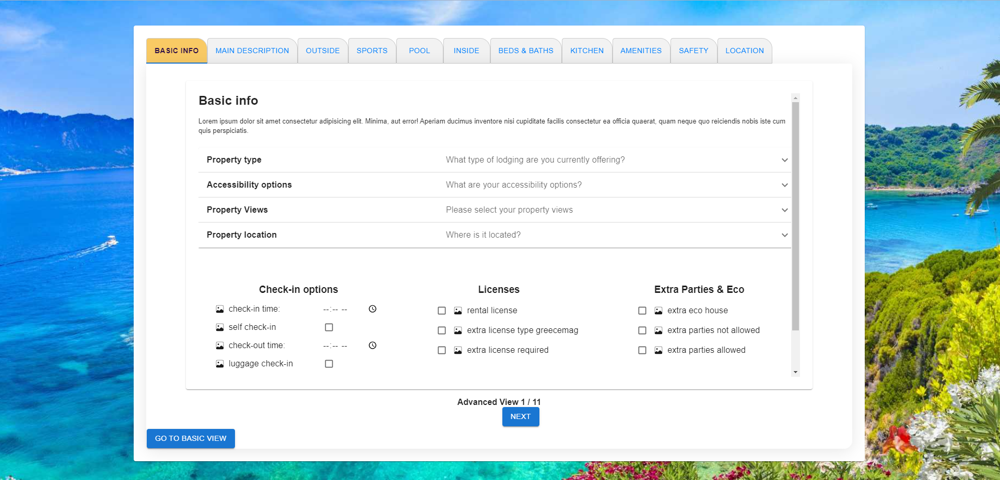

This is a [Next.js](https://nextjs.org/) project bootstrapped with [`create-next-app`](https://github.com/vercel/next.js/tree/canary/packages/create-next-app).



# Multi-step form page for new villa owners 
This project is a front-end page created to serve as the initiation point of new villa owners for a villa renting business. The form is divided into two modes, the basic and the advanced one and as a result it offers 2 submit points, one on the second tab (basic view) by which point the owner will have filled out the most basic information that's required to get them started within 5-10 minutes and then they may either submit the form there and finish or hit the advanced view button which opens up all the sections to go through a detailed listing of what they offer (advanced view). On submit the information is then posted to the desired backend endpoint as JSON towards the creation of a new account.

## How to run it locally

After cloning the project perform 'npm install' on your vscode terminal to install dependencies and run the development server using command:

```bash
npm run dev
```

Open [http://localhost:3000](http://localhost:3000) with your browser to see the result.

You can start editing the page by modifying `app/page.tsx` or the React components under `src/components` directory. The page auto-updates as you edit the file.


